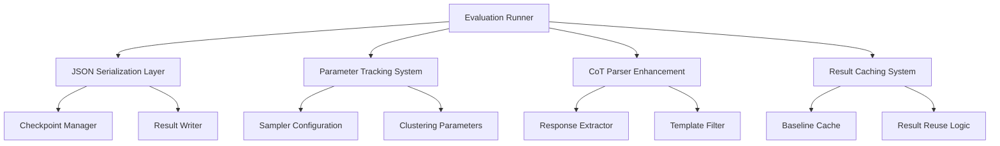

# Design Document

## Overview

This design addresses the critical issues in the DCBS evaluation system by implementing comprehensive fixes for JSON serialization, parameter tracking, chain-of-thought parsing, and evaluation efficiency. The solution maintains backward compatibility while significantly improving system reliability and performance.

## Architecture

### Component Overview



## Components and Interfaces

### 1. Enhanced JSON Serialization System

#### SerializationUtils Class
```python
class SerializationUtils:
    @staticmethod
    def convert_to_json_serializable(obj: Any) -> Any:
        """Recursively convert objects to JSON-serializable format"""
        
    @staticmethod
    def handle_numpy_types(obj: Any) -> Any:
        """Convert numpy types to native Python types"""
        
    @staticmethod
    def handle_torch_types(obj: Any) -> Any:
        """Convert torch tensors to serializable format"""
```

**Key Features:**
- Recursive conversion of nested objects
- Support for numpy int64, float64, arrays
- Torch tensor handling with device information
- Graceful fallback for unknown types
- Detailed error reporting with object path

### 2. Parameter Tracking Enhancement

#### ParameterTracker Class
```python
class ParameterTracker:
    def __init__(self):
        self.sampler_configs = {}
        self.clustering_configs = {}
        self.evaluation_metadata = {}
    
    def record_sampler_config(self, sampler_name: str, config: Dict) -> None:
        """Record complete sampler configuration"""
        
    def record_clustering_config(self, method: str, params: Dict) -> None:
        """Record clustering method parameters"""
        
    def get_full_configuration(self) -> Dict:
        """Return complete configuration for result storage"""
```

**Configuration Capture:**
- DCBS parameters: k, top_n, clustering_method, eps, min_samples
- Sampler parameters: temperature, top_p, top_k values
- Model configuration: name, quantization, device info
- Evaluation settings: batch_size, CoT enabled, caching status

### 3. Chain-of-Thought Parser Enhancement

#### CoTResponseParser Class
```python
class CoTResponseParser:
    def __init__(self):
        self.template_patterns = [
            r"LM that thinks step by step before answering",
            r"I need to think through this step by step",
            r"Let me analyze this question carefully"
        ]
    
    def extract_reasoning(self, response: str) -> str:
        """Extract actual reasoning content from response"""
        
    def is_template_response(self, response: str) -> bool:
        """Check if response is just template text"""
        
    def validate_reasoning_quality(self, reasoning: str) -> bool:
        """Validate that reasoning contains substantive content"""
```

**Parsing Logic:**
1. Remove template phrases and boilerplate text
2. Extract substantive reasoning content
3. Validate minimum reasoning length and quality
4. Handle malformed or empty responses gracefully
5. Log parsing issues for debugging

### 4. Evaluation Efficiency System

#### ResultCacheManager Class
```python
class ResultCacheManager:
    def __init__(self):
        self.baseline_cache = {}
        self.cache_keys = {}
    
    def generate_cache_key(self, config: Dict) -> str:
        """Generate unique cache key for configuration"""
        
    def cache_baseline_results(self, key: str, results: Dict) -> None:
        """Cache baseline sampler results"""
        
    def get_cached_results(self, key: str) -> Optional[Dict]:
        """Retrieve cached results if available"""
        
    def is_compatible_config(self, config1: Dict, config2: Dict) -> bool:
        """Check if configurations are compatible for result reuse"""
```

**Caching Strategy:**
- Cache baseline results (greedy, top-p, random) separately from DCBS
- Generate cache keys based on model, dataset, and core parameters
- Validate parameter compatibility before reusing results
- Maintain cache metadata for debugging and validation

## Data Models

### Enhanced Result Structure
```python
@dataclass
class EvaluationResult:
    # Core result data
    dataset: str
    sampler_name: str
    accuracy: float
    confidence_interval: Tuple[float, float]
    
    # Parameter tracking
    sampler_config: Dict
    clustering_config: Optional[Dict]
    model_config: Dict
    
    # Detailed results
    individual_results: List[Dict]
    statistical_analysis: Dict
    
    # Metadata
    timestamp: str
    git_commit: Optional[str]
    system_info: Dict
```

### Enhanced Checkpoint State
```python
@dataclass
class CheckpointState:
    # Existing fields
    run_id: str
    timestamp: str
    total_examples: int
    completed_examples: int
    
    # Enhanced fields
    parameter_config: Dict  # Complete parameter tracking
    cached_baseline_results: Dict  # Cached baseline results
    serialization_metadata: Dict  # Serialization debugging info
    
    def to_dict(self) -> Dict:
        """Convert to JSON-serializable dictionary"""
        return SerializationUtils.convert_to_json_serializable(asdict(self))
```

## Error Handling

### Serialization Error Recovery
```python
class SerializationErrorHandler:
    def handle_serialization_error(self, obj: Any, error: Exception) -> Any:
        """Handle serialization errors with graceful degradation"""
        
    def create_error_report(self, obj: Any, path: str) -> Dict:
        """Create detailed error report for debugging"""
        
    def attempt_fallback_serialization(self, obj: Any) -> Any:
        """Attempt alternative serialization methods"""
```

### Evaluation Error Recovery
```python
class EvaluationErrorHandler:
    def handle_dataset_failure(self, dataset: str, error: Exception) -> None:
        """Handle individual dataset evaluation failures"""
        
    def save_partial_results(self, completed_results: List[Dict]) -> None:
        """Save partial results when evaluation fails"""
        
    def generate_failure_report(self, failures: List[Dict]) -> Dict:
        """Generate comprehensive failure analysis"""
```

## Testing Strategy

### Unit Tests
1. **SerializationUtils Tests**
   - Test numpy type conversion
   - Test torch tensor handling
   - Test nested object conversion
   - Test error handling for unknown types

2. **ParameterTracker Tests**
   - Test configuration capture
   - Test parameter validation
   - Test configuration comparison
   - Test serialization of tracked parameters

3. **CoTResponseParser Tests**
   - Test template phrase removal
   - Test reasoning extraction
   - Test quality validation
   - Test malformed response handling

4. **ResultCacheManager Tests**
   - Test cache key generation
   - Test result caching and retrieval
   - Test configuration compatibility
   - Test cache invalidation

### Integration Tests
1. **End-to-End Serialization**
   - Test complete evaluation result serialization
   - Test checkpoint save/load cycle
   - Test error recovery scenarios

2. **Parameter Tracking Integration**
   - Test parameter capture across evaluation pipeline
   - Test result file parameter inclusion
   - Test configuration reproduction

3. **Efficiency Optimization**
   - Test baseline result reuse
   - Test multi-clustering evaluation optimization
   - Test cache hit rates and performance

### Performance Tests
1. **Serialization Performance**
   - Benchmark serialization time for large results
   - Test memory usage during serialization
   - Compare performance with/without optimization

2. **Caching Effectiveness**
   - Measure evaluation time reduction
   - Test cache memory usage
   - Validate result accuracy with caching

## Implementation Plan

### Phase 1: Core Fixes (High Priority)
1. Implement SerializationUtils with comprehensive type handling
2. Update CheckpointManager to use enhanced serialization
3. Fix CoTResponseParser to handle template text properly
4. Add parameter tracking to all sampler creation points

### Phase 2: Efficiency Optimization (Medium Priority)
1. Implement ResultCacheManager for baseline result reuse
2. Update evaluation runner to use caching system
3. Add configuration validation before evaluation start
4. Implement partial result saving for error recovery

### Phase 3: Enhanced Features (Lower Priority)
1. Add comprehensive metadata tracking (git commit, system info)
2. Implement advanced statistical analysis in results
3. Add result comparison and analysis tools
4. Create evaluation report generation system

## Configuration Examples

### Enhanced Configuration Structure
```yaml
# Core evaluation settings
model:
  name: "meta-llama/Llama-3.2-1B-Instruct"
  quantization: "4bit"
  device: "cuda"

# Sampler configurations
samplers:
  dcbs:
    k: 8
    top_n: 50
    clustering_method: "dbscan"
    dbscan_eps: 0.3
    dbscan_min_samples: 2
    enable_caching: true
  
  greedy:
    temperature: 1.0
  
  top_p:
    p: 0.9
    temperature: 1.0

# Evaluation settings
evaluation:
  include_cot: true
  batch_size: 100
  enable_baseline_caching: true
  save_detailed_results: true

# Error handling
error_handling:
  continue_on_dataset_failure: true
  save_partial_results: true
  max_retries: 3
```

This design provides a comprehensive solution to all identified issues while maintaining system reliability and improving performance through intelligent caching and optimization strategies.