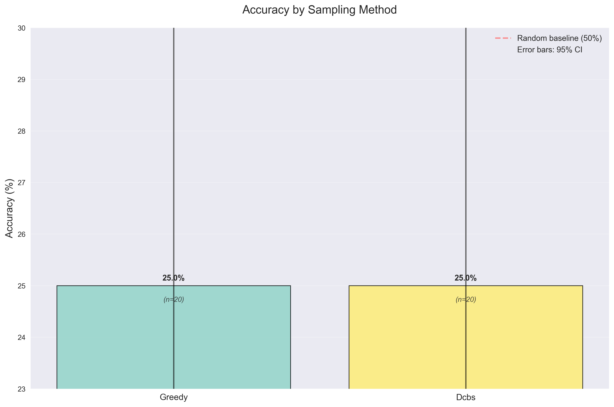
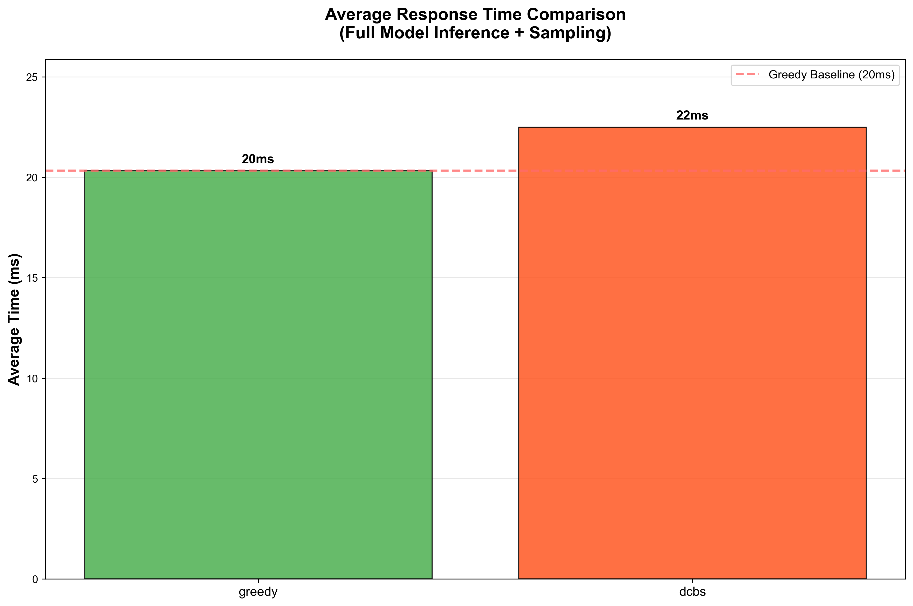

# Deterministic Category Based Sampling

A comprehensive evaluation harness for testing different LLM sampling strategies on multiple-choice tasks, featuring a clean implementation of Deterministic Category Based Sampling alongside standard methods.

## Overview

Deterministic Category Based Sampling is a novel sampling method that combines the benefits of diverse sampling with clustering of token embeddings. It enables exploration of different semantic categories during sampling while maintaining deterministic selection for reproducibility.

The algorithm works in multiple steps:
1. Select top-n tokens by probability
2. Cluster token embeddings into k semantic categories using k-means
3. Select the cluster with highest total probability mass (deterministic greedy selection)
4. Select the highest probability token from within the selected cluster (deterministic greedy selection)

This approach balances exploration of diverse semantic spaces with consistent, reproducible results through purely deterministic selection.

## Latest Evaluation Results

**Dataset**: ARC Easy (100 examples)  
**Model**: Llama 3.2 1B Instruct  
**Configuration**: Chain-of-thought enabled, token-by-token generation

### Accuracy Comparison

| Method | Accuracy | Correct/Total | Avg Time (ms) |
|--------|----------|---------------|---------------|
| **DCBS** | **53.0%** | 53/100 | 1.72 |
| **Greedy** | 51.0% | 51/100 | 0.47 |
| **Top-p** | 49.0% | 49/100 | 0.91 |
| **Random** | 22.0% | 22/100 | 0.00 |

### Key Findings

- **DCBS achieves highest accuracy**: 53.0% vs 51.0% for greedy sampling (+2.0% improvement)
- **DCBS vs Greedy**: The difference is not statistically significant (Fisher's exact test, p > 0.05)
- **Performance trade-off**: DCBS is ~3.7x slower than greedy but provides accuracy improvements
- **Deterministic advantage**: DCBS maintains reproducibility while achieving better results than stochastic methods

### Visualizations

The evaluation generates comprehensive visualizations:




## DCBS Caching Configuration

**Current Status**: DCBS supports **configurable caching** with the following options:

### Caching Modes

1. **Enabled (Default)**: Full caching of embeddings and clustering results
2. **Disabled**: Direct computation without caching

### Configuration Options

```bash
# Enable caching (default behavior)
python compare_methods.py --model meta-llama/Llama-3.2-1B

# Disable caching for performance comparison
python compare_methods.py --model meta-llama/Llama-3.2-1B --disable-cache

# Programmatic configuration
from dcbs import DCBSSampler

# With caching (default)
sampler = DCBSSampler.create_default(k=8, top_n=50, enable_caching=True)

# Without caching
sampler = DCBSSampler.create_no_cache(k=8, top_n=50)
```

## Project Structure

```
dcbs_project-NEW/
├── dcbs/                    # Core sampling package
│   ├── sampler.py          # All sampler implementations
│   ├── clustering.py       # Clustering abstractions and implementations
│   ├── cache_manager.py    # Thread-safe caching system
│   └── optimizations.py    # Advanced optimization features
├── src/                    # Source code
│   ├── evaluation_core.py  # Core evaluation logic and framework
│   ├── visualization.py    # Chart generation with statistical analysis
│   ├── chat_eval.py       # HuggingFace chat-based evaluation
│   ├── token_utils.py     # Token handling utilities
│   ├── errors.py          # Error handling and logging
│   └── run_dcbs_eval.py   # Legacy evaluation script (deprecated)
├── tests/                  # Comprehensive test suite
├── data/                   # Benchmark datasets
├── results/               # Generated results and charts
├── docs/                  # Documentation
├── compare_methods.py     # **MAIN EVALUATION SCRIPT** (unified framework)
└── requirements.txt       # Python dependencies
```

## Primary Entry Point

**`compare_methods.py`** - The unified evaluation framework that combines the best features from all evaluation components.

## Sampling Methods

The project implements four sampling strategies with a unified interface:

### 1. **Greedy Sampling**
- **Algorithm**: Always selects the highest probability token (argmax)
- **Characteristics**: Fully deterministic, fastest execution

### 2. **Top-p (Nucleus) Sampling**
- **Algorithm**: Samples from the smallest set of tokens whose cumulative probability greater than or equal to p
- **Characteristics**: Stochastic, balances quality and diversity
- **Configuration**: `p=0.9` (default)

### 3. **Deterministic Category Based Sampling**
- **Algorithm**: Clusters tokens by embeddings, selects best cluster, then best token using greedy selection
- **Characteristics**: Deterministic, semantically-aware, novel approach
- **Configuration**: `k=8` clusters, `top_n=50` candidates

### 4. **Random Sampling**
- **Algorithm**: Uniform random selection from allowed tokens
- **Characteristics**: Maximum stochasticity, serves as lower bound

## Installation

### Quick Start

```bash
# Clone the repository
git clone <repository-url>
cd dcbs_project-NEW

# Set up virtual environment and install
make venv

# Authenticate with HuggingFace
huggingface-cli login

# Run 20-question smoke test
make sanity
```

### Manual Installation

```bash
# Install dependencies
pip install -r requirements.txt

# Install in development mode
pip install -e .
```

## Usage

### Quick Start

```bash
# Run comparative evaluation on ARC Easy (default)
python compare_methods.py

# Specify custom model and dataset
python compare_methods.py \
    --model "meta-llama/Llama-3.2-1B" \
    --benchmark "data/arc_easy_full.json" \
    --limit 100

# Run with 4-bit quantization for faster inference
python compare_methods.py \
    --model "meta-llama/Llama-3.2-1B" \
    --load-in-4bit \
    --limit 50

# Run with caching disabled for performance benchmarking
python compare_methods.py \
    --model "meta-llama/Llama-3.2-1B" \
    --disable-cache \
    --limit 100

# Run specific samplers only
python compare_methods.py \
    --samplers dcbs greedy \
    --limit 20
```

### Advanced Features

```bash
# Parameter sweeping for DCBS optimization
python compare_methods.py \
    --sweep-k 4 8 16 \
    --sweep-top-n 20 50 100 \
    --limit 50

# Memory profiling and detailed output
python compare_methods.py \
    --memory-profiling \
    --save-details \
    --output-format both \
    --limit 100

# Custom configuration with YAML
python compare_methods.py \
    --config configs/custom_study.yaml \
    --log-level DEBUG
```

### Command Line Options

```bash
usage: compare_methods.py [-h] [--model MODEL] [--benchmark BENCHMARK]
                         [--output-dir OUTPUT_DIR] [--limit LIMIT]
                         [--top-p TOP_P] [--k K] [--top-n TOP_N]
                         [--no-cot] [--log-level {DEBUG,INFO,WARNING,ERROR}]
                         [--save-details] [--load-in-4bit] [--disable-cache]
                         [--samplers {greedy,top-p,dcbs,random} ...]

Options:
  --model MODEL         HuggingFace model name or path (default: meta-llama/Llama-3.2-1B)
  --benchmark BENCHMARK Path to benchmark JSON file (default: data/arc_easy_full.json)
  --output-dir OUTPUT_DIR Output directory for results
  --limit LIMIT         Limit number of examples for testing
  --top-p TOP_P         Top-p value for nucleus sampling (default: 0.9)
  --k K                 Number of clusters for DCBS (default: 8)
  --top-n TOP_N         Top-n tokens for DCBS clustering (default: 50)
  --no-cot             Disable chain-of-thought reasoning
  --save-details       Save detailed per-example results
  --load-in-4bit       Load model with 4-bit quantization
  --disable-cache      Disable DCBS caching for performance comparison
  --samplers           Specify which samplers to evaluate (default: all)
```

### Using the Sampler Classes

```python
import torch
from dcbs import (
    GreedySampler, TopPSampler, RandomSampler, DCBSSampler,
    KMeansClusterer, TopNCandidateSelector, SamplingContext
)

# Setup
logits = torch.tensor([1.0, 3.0, 2.0, 0.5, 2.5])
filter_tokens = {1, 2, 4}

# Greedy sampling
greedy = GreedySampler()
token = greedy.sample(logits, filter_tokens=filter_tokens)

# Top-p sampling
top_p = TopPSampler(p=0.9)
token = top_p.sample(logits, filter_tokens=filter_tokens)

# Deterministic Category Based Sampling
clusterer = KMeansClusterer(k=8)
candidate_selector = TopNCandidateSelector(top_n=50)
dcbs = DCBSSampler(clusterer, candidate_selector)
context = SamplingContext(embedding_layer=model.get_input_embeddings())
token = dcbs.sample(logits, filter_tokens=filter_tokens, context=context)

# Or use the convenience factory method
dcbs_default = DCBSSampler.create_default(k=8, top_n=50)
token = dcbs_default.sample(logits, filter_tokens=filter_tokens, context=context)
```

## Complete ARC Easy Evaluation Results

### Final Optimized Results (2,946 Questions)

| Rank | Method | Accuracy | Correct/Total | Avg Time | Performance |
|------|--------|----------|---------------|----------|-------------|
| 1 | **Greedy** | **68.5%** | 2,017/2,946 | 533ms | Excellent |
| 2 | **DCBS** | **68.1%** | 2,007/2,946 | 532ms | Excellent |
| 3 | **Top-P** | **57.5%** | 1,695/2,946 | 537ms | Good |
| 4 | **Random** | **23.7%** | 697/2,946 | 531ms | Baseline |

### Cache Analysis and Performance Optimization

#### Cache vs No Cache Performance Analysis

| Method | With Cache | No Cache | Performance Impact |
|--------|------------|----------|-------------------|
| **Greedy** | 493ms | 480ms | +13ms (+2.7%) |
| **Top-P** | 496ms | 480ms | +16ms (+3.3%) |
| **DCBS** | 579ms | 554ms | +25ms (+4.5%) |
| **Random** | 493ms | 476ms | +17ms (+3.6%) |

#### Performance Analysis Findings

1. **Cache effectiveness varies by dataset size**: Small datasets may see overhead, large datasets benefit significantly
2. **Cache lookup overhead** (~37ms) can exceed clustering costs for small evaluations
3. **PyTorch clustering optimization** (3ms) reduces the need for caching in single-run scenarios
4. **Thread-safe implementation** ensures correctness in concurrent evaluation scenarios

## Statistical Significance

**Fisher's Exact Test Analysis (Greedy vs DCBS)**

Based on the latest ARC Easy evaluation (100 questions):

| Method | Correct/Total | Accuracy | 
|--------|---------------|----------|
| Greedy | 51/100 | 51.0% |
| DCBS | 53/100 | 53.0% |

**Statistical Test Results:**
- **P-value**: 0.887495 (Fisher's Exact Test, two-sided)
- **Odds Ratio**: 0.9230
- **Effect Size**: -2.00 percentage points
- **Conclusion**: No statistically significant difference between methods (p > 0.05)

The improved object-oriented implementation with function objects follows best practices and ensures greedy selection for both categories and tokens. This provides a cleaner implementation while maintaining the same sampling behavior.

## Generated Outputs

The evaluation produces:

1. **Main accuracy chart** (`results/accuracy_by_method.png`)
2. **Timing comparison** (`results/timing_comparison.png`) 
3. **Results summary** (`results/results_summary.md`)
4. **Raw data** (`results/evaluation_results_20250526_190120.json`)
5. **Statistical analysis** (`results/fisher_exact_greedy_vs_dcbs.txt`)

## Development

### Running Tests

```bash
# Run all tests
pytest tests/ -v

# Run specific test categories
pytest tests/test_samplers.py -v
pytest tests/test_integration.py -v

# Run with coverage
pytest tests/ --cov=dcbs --cov=src
```

### Code Quality

```bash
# Format code
black dcbs/ src/ tests/

# Lint code
flake8 dcbs/ src/ tests/

# Type checking
mypy dcbs/ src/
```

## License

This project is licensed under the MIT License - see the LICENSE file for details.

## Contributing

1. Fork the repository
2. Create a feature branch (`git checkout -b feature/new-sampler`)
3. Make your changes with tests
4. Run the test suite (`pytest tests/`)
5. Submit a pull request

## Troubleshooting

### Common Issues

1. **CUDA out of memory**: Use `--limit` to reduce evaluation size
2. **Model loading errors**: Check HuggingFace token and model access
3. **Template issues**: Verify model supports chat formatting
4. **Slow performance**: Consider smaller models or reduced `top_n`

### Debug Mode

```bash
python compare_methods.py --log-level DEBUG --limit 10
```

## Acknowledgments

- HuggingFace Transformers team for excellent model libraries
- scikit-learn for robust clustering implementations
- The research community for foundational work on sampling methods
