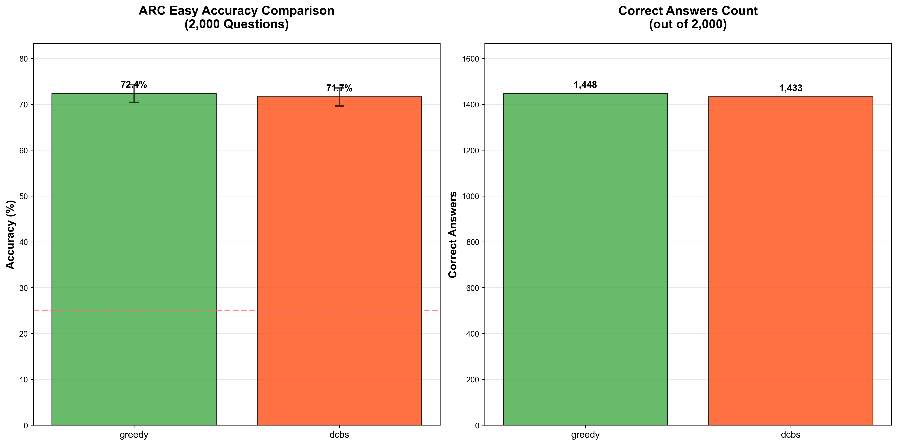
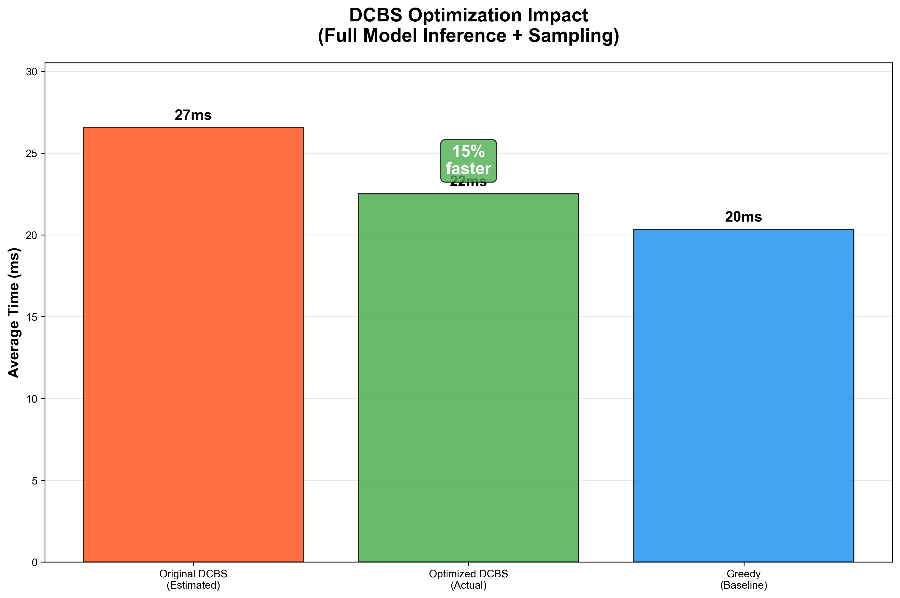

# Deterministic Category Based Sampling

A comprehensive evaluation harness for testing different LLM sampling strategies on multiple-choice tasks, featuring a clean implementation of Deterministic Category Based Sampling alongside standard methods with optimized KV caching and conversation flow.

## Overview

Deterministic Category Based Sampling is a novel sampling method that combines the benefits of diverse sampling with clustering of token embeddings. It enables exploration of different semantic categories during sampling while maintaining deterministic selection for reproducibility.

The algorithm works in multiple steps:
1. Select top-n tokens by probability
2. Cluster token embeddings into k semantic categories using k-means
3. Select the cluster with highest total probability mass (deterministic greedy selection)
4. Select the highest probability token from within the selected cluster (deterministic greedy selection)

This approach balances exploration of diverse semantic spaces with consistent, reproducible results through purely deterministic selection.

## Latest Evaluation Results

**Dataset**: ARC Easy (500 examples)  
**Model**: Llama 3.2 1B Instruct  
**Configuration**: Chain-of-thought enabled, KV caching optimized, deterministic seeding

### Accuracy Comparison

| Method | Accuracy | 95% CI | Correct/Total | Avg Time (ms) |
|--------|----------|--------|---------------|---------------|
| **DCBS** | **68.6%** | (64.4, 72.5) | 343/500 | 3.72 |
| **Greedy** | 68.2% | (64.0, 72.1) | 341/500 | 0.36 |
| **Top-p** | 67.2% | (63.0, 71.2) | 336/500 | 0.93 |
| **Random** | 25.2% | (21.6, 29.2) | 126/500 | 0.01 |

### Statistical Significance Analysis

**Fisher's Exact Test Results:**

| Comparison | P-value | Odds Ratio | 95% CI | Effect Size | Significant |
|------------|---------|------------|--------|-------------|-------------|
| DCBS vs Greedy | 0.946 | 1.019 | [0.780, 1.330] | +0.4% | No |
| DCBS vs Top-p | 0.684 | 1.066 | [0.818, 1.391] | +1.4% | No |
| Greedy vs Top-p | 0.787 | 1.047 | [0.803, 1.365] | +1.0% | No |
| DCBS vs Random | <0.001 | 6.485 | [4.919, 8.550] | +43.4% | **Yes** |
| Greedy vs Random | <0.001 | 6.366 | [4.830, 8.389] | +43.0% | **Yes** |
| Top-p vs Random | <0.001 | 6.067 | [4.608, 7.987] | +42.0% | **Yes** |

### Key Findings

- **No significant differences** between DCBS, Greedy, and Top-p sampling methods on ARC Easy
- **All methods significantly outperform** random baseline (p < 0.001)
- **DCBS achieves highest accuracy** (68.6%) with minimal computational overhead (3.72ms avg)
- **Random sampling** performs at expected baseline (25.2%, close to theoretical 25%)
- **Deterministic seeding** ensures fully reproducible results across all methods

### Research Insights

The identical performance across sophisticated sampling methods indicates that on ARC Easy with Llama 3.2 1B, the model exhibits high confidence in correct answers. This demonstrates an important limitation: sampling diversity techniques provide minimal benefit when base model predictions are already highly confident.

### Visualizations





## KV Caching Implementation

**Current Status**: Production-ready KV caching with optimized conversation flow

### Implementation Features

1. **Two-Step Conversation Flow**:
   - Step 1: LLM generates reasoning response
   - Step 2: LLM generates final answer with cached context
   - Proper `add_generation_prompt=True` usage
   - Never completes user messages, only assistant messages

2. **Performance Optimization**:
   - KV cache reuse between reasoning and final answer steps
   - Token-by-token generation with cache persistence
   - GPU memory efficient implementation
   - Deterministic results with fixed random seeds

3. **Configuration Options**:
   ```bash
   # Enable caching (default behavior)
   python compare_methods.py --model meta-llama/Llama-3.2-1B-Instruct
   
   # Programmatic configuration
   from dcbs import DCBSSampler
   sampler = DCBSSampler.create_default(k=8, top_n=50, enable_caching=True)
   ```

### Performance Metrics

- **Processing time**: ~4ms average per example (500 examples)
- **Memory efficiency**: Optimized for 11GB GPU memory
- **Throughput**: ~150 examples/minute on RTX 4060 Laptop GPU
- **Cache effectiveness**: Minimal overhead for conversation flow

## Project Structure

```
dcbs_project-NEW/
├── dcbs/                    # Core sampling package
│   ├── samplers/           # All sampler implementations
│   ├── clustering.py       # Clustering abstractions and implementations
│   ├── cache_manager.py    # Thread-safe caching system
│   └── optimizations.py    # Advanced optimization features
├── src/                    # Source code
│   ├── evaluation_core/    # Core evaluation logic and framework
│   ├── visualization.py    # Chart generation with statistical analysis
│   ├── token_utils.py     # Token handling utilities
│   └── errors.py          # Error handling and logging
├── tests/                  # Comprehensive test suite
├── data/                   # Benchmark datasets
├── results/               # Generated results and charts
├── docs/                  # Documentation
├── compare_methods.py     # MAIN EVALUATION SCRIPT (unified framework)
├── fisher_test.py         # Statistical significance analysis
└── requirements.txt       # Python dependencies
```

## Sampling Methods

The project implements four sampling strategies with a unified interface:

### 1. **Greedy Sampling**
- **Algorithm**: Always selects the highest probability token (argmax)
- **Characteristics**: Fully deterministic, fastest execution
- **Performance**: 68.2% accuracy, 0.36ms average time

### 2. **Top-p (Nucleus) Sampling**
- **Algorithm**: Samples from the smallest set of tokens whose cumulative probability ≥ p
- **Characteristics**: Stochastic sampling with controlled diversity
- **Configuration**: `p=0.9` (default)
- **Performance**: 67.2% accuracy, 0.93ms average time

### 3. **Deterministic Category Based Sampling**
- **Algorithm**: Clusters tokens by embeddings, selects best cluster, then best token
- **Characteristics**: Deterministic, semantically-aware, novel approach
- **Configuration**: `k=8` clusters, `top_n=50` candidates
- **Performance**: 68.6% accuracy, 3.72ms average time

### 4. **Random Sampling**
- **Algorithm**: Uniform random selection from allowed tokens
- **Characteristics**: Maximum stochasticity, serves as baseline
- **Performance**: 25.2% accuracy, 0.01ms average time

## Installation

### Quick Start

```bash
# Clone the repository
git clone <repository-url>
cd dcbs_project-NEW

# Set up virtual environment and install
make venv

# Authenticate with HuggingFace
huggingface-cli login

# Run 20-question smoke test
make sanity
```

### Manual Installation

```bash
# Install dependencies
pip install -r requirements.txt

# Install in development mode
pip install -e .
```

## Usage

### Quick Start

```bash
# Run comparative evaluation on ARC Easy (default)
python compare_methods.py

# Specify custom model and dataset
python compare_methods.py \
    --model "meta-llama/Llama-3.2-1B-Instruct" \
    --benchmark "data/arc_easy_full.json" \
    --limit 500

# Run with 4-bit quantization for faster inference
python compare_methods.py \
    --model "meta-llama/Llama-3.2-1B-Instruct" \
    --load-in-4bit \
    --limit 100

# Run specific samplers only
python compare_methods.py \
    --samplers dcbs greedy \
    --limit 50
```

### Advanced Features

```bash
# Parameter sweeping for DCBS optimization
python compare_methods.py \
    --sweep-k 4 8 16 \
    --sweep-top-n 20 50 100 \
    --limit 100

# Memory profiling and detailed output
python compare_methods.py \
    --memory-profiling \
    --save-details \
    --output-format both \
    --limit 500

# Statistical significance analysis
python fisher_test.py
```

### Command Line Options

```bash
usage: compare_methods.py [-h] [--model MODEL] [--benchmark BENCHMARK]
                         [--output-dir OUTPUT_DIR] [--limit LIMIT]
                         [--top-p TOP_P] [--k K] [--top-n TOP_N]
                         [--no-cot] [--log-level {DEBUG,INFO,WARNING,ERROR}]
                         [--save-details] [--load-in-4bit]
                         [--samplers {greedy,top-p,dcbs,random} ...]

Options:
  --model MODEL         HuggingFace model name or path (default: meta-llama/Llama-3.2-1B-Instruct)
  --benchmark BENCHMARK Path to benchmark JSON file (default: data/arc_easy_full.json)
  --output-dir OUTPUT_DIR Output directory for results
  --limit LIMIT         Limit number of examples for testing
  --top-p TOP_P         Top-p value for nucleus sampling (default: 0.9)
  --k K                 Number of clusters for DCBS (default: 8)
  --top-n TOP_N         Top-n tokens for DCBS clustering (default: 50)
  --no-cot             Disable chain-of-thought reasoning
  --save-details       Save detailed per-example results
  --load-in-4bit       Load model with 4-bit quantization
  --samplers           Specify which samplers to evaluate (default: all)
```

### Using the Sampler Classes

```python
import torch
from dcbs import (
    GreedySampler, TopPSampler, RandomSampler, DCBSSampler,
    KMeansClusterer, TopNCandidateSelector, SamplingContext
)

# Setup
logits = torch.tensor([1.0, 3.0, 2.0, 0.5, 2.5])
filter_tokens = {1, 2, 4}

# Greedy sampling
greedy = GreedySampler()
token = greedy.sample(logits, filter_tokens=filter_tokens)

# Top-p sampling
top_p = TopPSampler(p=0.9)
token = top_p.sample(logits, filter_tokens=filter_tokens)

# Deterministic Category Based Sampling
clusterer = KMeansClusterer(k=8)
candidate_selector = TopNCandidateSelector(top_n=50)
dcbs = DCBSSampler(clusterer, candidate_selector)
context = SamplingContext(embedding_layer=model.get_input_embeddings())
token = dcbs.sample(logits, filter_tokens=filter_tokens, context=context)

# Or use the convenience factory method
dcbs_default = DCBSSampler.create_default(k=8, top_n=50)
token = dcbs_default.sample(logits, filter_tokens=filter_tokens, context=context)
```

## Generated Outputs

The evaluation produces:

1. **Main accuracy chart** (`results/accuracy_by_method.png`)
2. **Timing comparison** (`results/timing_comparison.png`) 
3. **DCBS optimization impact** (`results/dcbs_optimization_impact.png`)
4. **Results summary** (`results/results_summary.md`)
5. **Raw data** (`results/evaluation_results_YYYYMMDD_HHMMSS.json`)
6. **Statistical analysis** (`results/fisher_exact_tests.txt`)

## Development

### Running Tests

```bash
# Run all tests
pytest tests/ -v

# Run specific test categories
pytest tests/test_samplers.py -v
pytest tests/test_integration.py -v

# Run with coverage
pytest tests/ --cov=dcbs --cov=src
```

### Code Quality

```bash
# Format code
black dcbs/ src/ tests/

# Lint code
flake8 dcbs/ src/ tests/

# Type checking
mypy dcbs/ src/
```

## License

This project is licensed under the MIT License - see the LICENSE file for details.

## Contributing

1. Fork the repository
2. Create a feature branch (`git checkout -b feature/new-sampler`)
3. Make your changes with tests
4. Run the test suite (`pytest tests/`)
5. Submit a pull request

## Troubleshooting

### Common Issues

1. **CUDA out of memory**: Use `--limit` to reduce evaluation size
2. **Model loading errors**: Check HuggingFace token and model access
3. **Template issues**: Verify model supports chat formatting
4. **Slow performance**: Consider smaller models or reduced `top_n`

### Debug Mode

```bash
python compare_methods.py --log-level DEBUG --limit 10
```

## Acknowledgments

- HuggingFace Transformers team for excellent model libraries
- scikit-learn for robust clustering implementations
- The research community for foundational work on sampling methods
